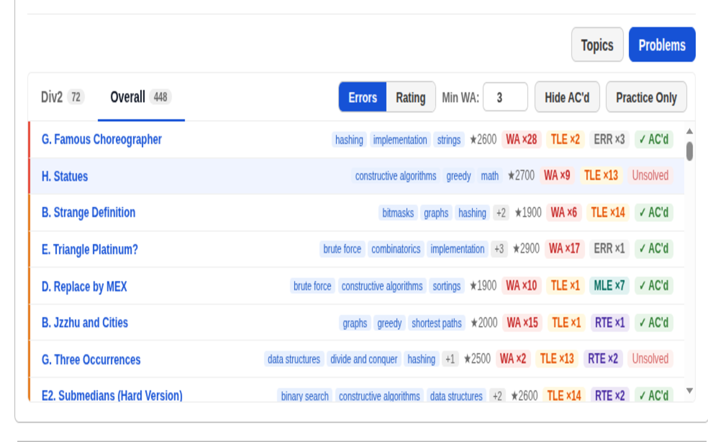
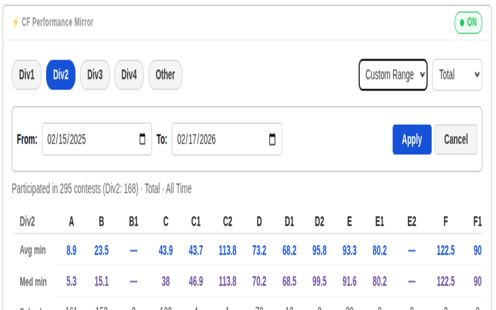

# CF Performance Mirror
Analyse your Codeforces profile — solve times, WA% by topic and problem, division breakdown, and time-range filters.

## Install from Chrome Web Store

- [Install CF Performance Mirror (Chrome)](https://chromewebstore.google.com/detail/cf-performance-mirror/lpbkkcofbkmghobeeeipbdgohbckcdgj)

## Install from Firefox Add-ons

- [Install CF Performance Mirror (Firefox)](https://addons.mozilla.org/en-US/firefox/addon/cf-performance-mirror/)

## Features
1. Solve Time Analysis — Avg & median solve time per problem index (A–H), broken down by division.
2. WA% Friction — WA, TLE, RTE, MLE counts by topic or problem. Click any topic to expand problems with direct links and solved/unsolved status.
3. Division-Aware — Auto-splits into Div1/2/3/4/Other. Combined/Global rounds are assigned based on your rating at contest time.
4. Two Friction Views — Topics (tag-level, sortable by WA% or attempts) and Problems (flat list, sortable by errors or rating).
5. Category + Overall Tabs — Division-specific stats plus an Overall tab with a Practice Only toggle.
6. Time-Range Filters — Last 1/3/6/12/24 months, all time, or custom date range.
7. Total / Rated / Unrated Toggle — Analyze all, rated-only, or unrated/virtual contests.
8. Noise Controls — Hide AC'd problems and set a minimum WA threshold to cut low-signal entries.
9. Persistent Settings — All filters, view mode, and sort order saved across sessions.
10. On/Off Toggle — Collapse to a slim header bar when not needed. State persists across page loads.
11. Lightweight & Themed — Inline below the profile box. Auto-matches Codeforces light/dark theme.

## How it works
Runs entirely client-side on `codeforces.com/profile/<handle>`. Fetches from three public Codeforces APIs (`user.status`, `contest.list`, `user.rating`). No server, no tracking — all computation happens in your browser.

## Quick install (Load unpacked)
1. Clone or download this repository to a local folder.
2. Open Chrome (or another Chromium-based browser) and go to chrome://extensions.
3. Enable "Developer mode" (top-right).
4. Click "Load unpacked" and select the repository folder.
5. Visit a Codeforces profile (e.g. https://codeforces.com/profile/<handle>) and refresh.

## Where it appears
- Injected into Codeforces profile pages (URLs matching `https://codeforces.com/profile/*` and subdomains).
- The panel appears as a compact card near existing profile boxes / page content.

## Privacy & security 🛡️
- No login required, no tracking, no backend — nothing is uploaded to any server.
- Uses only public Codeforces APIs from your browser (reads public profile/submission data).
- Requires host permission for Codeforces domains to fetch data directly.
- Inspect the source before installing if you want to verify behavior — the codebase is small and self-contained.

## Screenshots 🖼️

## Motivation / Philosophy
- Built for competitive programmers who want a private, quick snapshot of where they struggle and how long they take on problems.
- Lightweight, focused on actionable insights rather than dashboards — no tracking, no servers.

— Friendly to the CP community.