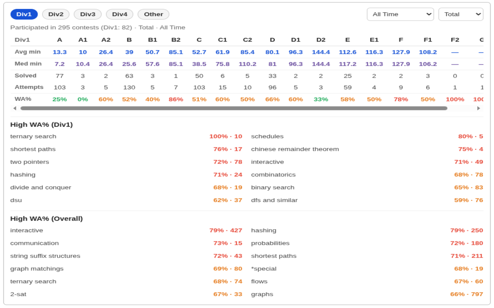
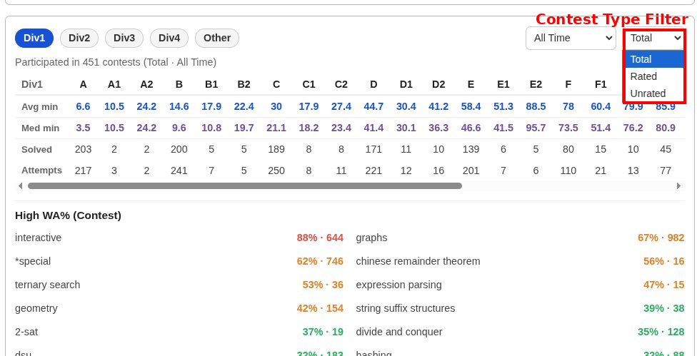
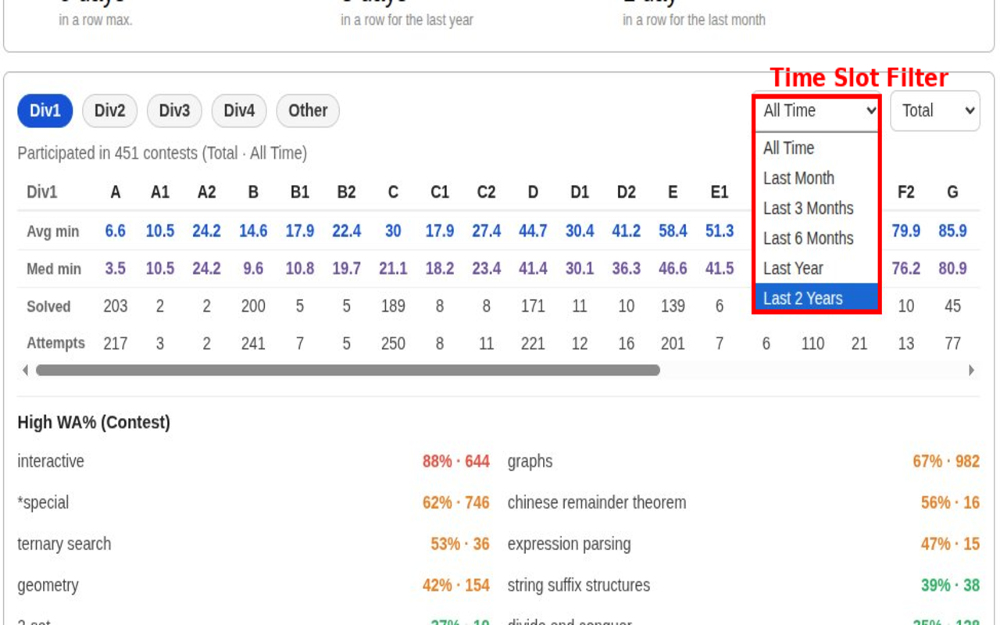

# CF Performance Mirror
Compact contest analytics for Codeforces profiles — average/median solve times and topic friction, shown directly on your profile page.

## Install from Chrome Web Store

- [Install CF Performance Mirror](https://chromewebstore.google.com/detail/cf-performance-mirror/lpbkkcofbkmghobeeeipbdgohbckcdgj)

## Features
- Average & median solve time per problem index (A–H)
- Division-wise breakdown (Div1–Div4, Other)
  - Div1+Div2 / Global contests are automatically treated as Div1 or Div2 based on your rating history
- Time window selector: All time • Last 1/3/6/12/24 months
  - Applies to both contest analytics and global WA% friction
- Mode switch: Total • Rated • Unrated (based on Codeforces contest rating data)
- High WA% (wrong-attempt percentage) topics for:
  - Contest submissions (only contests you participated in, within the selected time window)
  - Overall submissions (all Codeforces practice + contest submissions, within the same window)
- Shows unsolved problem indices (A–H) explicitly in the table
- Automatically adapts to Codeforces light/dark themes and surrounding profile styles, keeping a compact, native-looking UI

## Quick install (Load unpacked)
1. Clone or download this repository to a local folder.
2. Open Chrome (or another Chromium-based browser) and go to chrome://extensions.
3. Enable "Developer mode" (top-right).
4. Click "Load unpacked" and select the repository folder.
5. Visit a Codeforces profile (e.g. https://codeforces.com/profile/<handle>) and refresh.

## Where it appears
- Injected into Codeforces profile pages (URLs matching `https://codeforces.com/profile/*` and subdomains).
- The panel appears as a compact card near existing profile boxes / page content.

## Privacy & security 🛡️
- No login required, no tracking, no backend — nothing is uploaded to any server.
- Uses only public Codeforces APIs from your browser (reads public profile/submission data).
- Requires host permission for Codeforces domains to fetch data directly.
- Inspect the source before installing if you want to verify behavior — the codebase is small and self-contained.

## Screenshots 🖼️

## Motivation / Philosophy
- Built for competitive programmers who want a private, quick snapshot of where they struggle and how long they take on problems.
- Lightweight, focused on actionable insights rather than dashboards — no tracking, no servers.

— Friendly to the CP community.